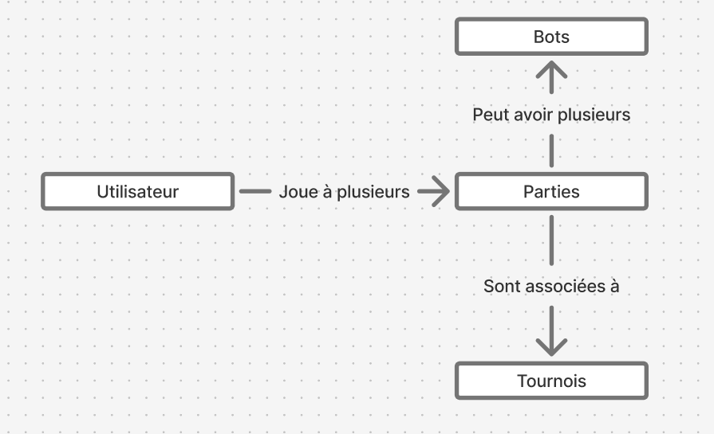
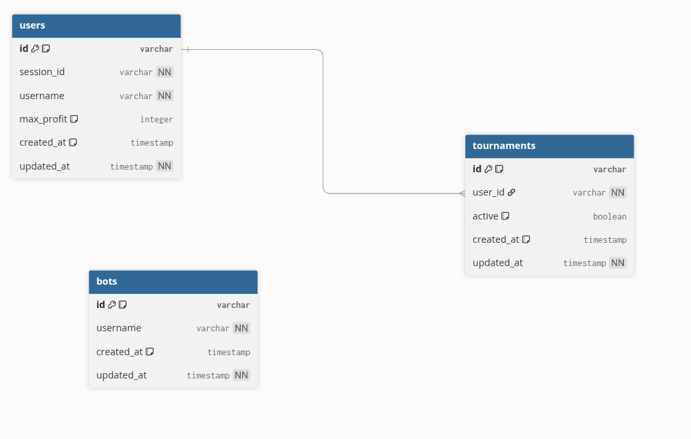

## Membres du groupe
Nom/prénom : M'BAREK Matis
Nom/prénom : CASSET Corentin

---

### 1. Présentation du Projet

Décrivez votre application en 3-5 phrases : problématique, objectif et fonctionnalités principales.

L'application de jeu de cartes en ligne permet aux utilisateurs de participer à des tournois de blackjack. 
L'objectif est de fournir une expérience simple, tout en garantissant la sécurité et l'intégrité des données des utilisateurs. Les fonctionnalités principales incluent la création de parties, le jeu en lui même, la gestion des utilisateurs, la création et la gestion de tournois / parties, ainsi que le suivi des performances des joueurs avec des analytics pour avoir des metrics sur différents sujets (ex: ).

### 2. Architecture PostgreSQL (Méthode Merise)

**MCD (Modèle Conceptuel de Données)**



**MLD (Modèle Logique de Données)**



**MPD (Modèle Physique de Données)**

```sql
CREATE EXTENSION IF NOT EXISTS pgcrypto;

CREATE TABLE users (
  id VARCHAR PRIMARY KEY,
  session_id VARCHAR UNIQUE NOT NULL,
  username VARCHAR NOT NULL,
  max_profit INTEGER DEFAULT 15000,
  created_at TIMESTAMP DEFAULT NOW(),
  updated_at TIMESTAMP DEFAULT NOW()
);

CREATE TABLE bots (
  id VARCHAR PRIMARY KEY,
  username VARCHAR NOT NULL,
  created_at TIMESTAMP DEFAULT NOW(),
  updated_at TIMESTAMP DEFAULT NOW()
);

CREATE TABLE tournaments (
  id VARCHAR PRIMARY KEY,
  user_id VARCHAR REFERENCES users(id) ON DELETE CASCADE,
  active BOOLEAN DEFAULT TRUE,
  created_at TIMESTAMP DEFAULT NOW(),
  updated_at TIMESTAMP DEFAULT NOW()
);
```

### 3. Architecture MongoDB

```json
{
  "_id": {
    "$oid": "69021dba61e322f696ce5f47"
  },
  "tournamentId": "550e8400-e29b-41d4-a716-446655440000",
  "timestamp": {
    "$date": "2025-10-28T20:10:00.000Z"
  },
  "rounds": [
    {
      "id": "4564257-uuid-1",
      "type": "PLAYER",
      "initialHand": [
        "K♣",
        "7♦"
      ],
      "action": "HIT",
      "turn": 0,
      "result": {
        "hand": [
          "K♣",
          "7♦",
          "2♦"
        ],
        "score": 19,
        "isBusted": false
      }
    },
    {
      "id": "8159565-uuid-2",
      "type": "BOT",
      "initialHand": [
        "9♣",
        "6♣"
      ],
      "action": "HIT",
      "turn": 1,
      "result": {
        "hand": [
          "9♣",
          "6♣",
          "8♦"
        ],
        "score": 23,
        "isBusted": true
      }
    },
    {
      "id": "-1-uuid-dealer",
      "type": "DEALER",
      "initialHand": [
        "9♣",
        "6♣"
      ],
      "action": null,
      "turn": null,
      "result": {
        "hand": [
          "9♣",
          "6♣",
          "6♦"
        ],
        "score": 21,
        "isBusted": false
      }
    },
    {
      "id": "4564257-uuid-1",
      "type": "PLAYER",
      "initialHand": [
        "K♣",
        "7♦",
        "2♦"
      ],
      "action": "HIT",
      "turn": 0,
      "result": {
        "hand": [
          "K♣",
          "7♦",
          "2♦",
          "6♣"
        ],
        "score": 25,
        "isBusted": true
      }
    }
  ],
  "winnerId": "-1-uuid-dealer",
  "metadata": {
    "durationSeconds": 42
  }
}
```

### 4. Justification des Choix Techniques

- **Répartition des données** : Quelles données en PostgreSQL ? Quelles données en MongoDB ? Pourquoi ?

Les données en PostgreSQL concernent les entités statiques et relationnelles : utilisateurs (users), bots et tournois (tournaments). Ces données sont persistantes, nécessitent des contraintes d'intégrité (clés étrangères, unicité) et des transactions ACID pour garantir la cohérence (ex. : mise à jour des profits après une partie). PostgreSQL est choisi pour sa robustesse dans la gestion des relations et des requêtes complexes (jointures, agrégats).

Les données en MongoDB concernent les parties (games) dynamiques et volatiles : rounds, mains de cartes, scores, métadonnées. Ces données sont flexibles (structure variable par round), fréquemment mises à jour pendant le jeu, et ne nécessitent pas de relations complexes. MongoDB est choisi pour sa scalabilité horizontale, sa gestion des documents imbriqués et sa performance sur les écritures fréquentes.


- **Modélisation MongoDB** : Documents imbriqués ou références ? Justification

Nous utilisons des documents imbriqués pour les rounds dans la collection games. Chaque partie contient un tableau rounds avec des objets imbriqués pour initialHand, result, etc. Cela évite les jointures coûteuses et permet de récupérer l'état complet d'une partie en une seule requête. Les références sont utilisées uniquement pour tournamentId (référence à PostgreSQL) et winnerId (référence interne légère).
Le choix d'utiliser les documents imbriqués est aussi justifié par le fait que les rounds ont une taille limitée, donc le document ne dépassera jamais la limite des 16MO de Mongo.


- **Relations inter-bases** : Comment les deux bases communiquent-elles ?

Les deux bases communiquent via des références légères : les parties Mongo contiennent un tournamentId qui référence l'id d'un tournoi Postgres. L'API gère la cohérence en récupérant les données de Postgres pour valider les utilisateurs/tournois avant de créer une partie Mongo.
Il n'y a pas de transactions distribuées complexes ; la logique métier assure la synchronisation (ex. : mise à jour des profits en PostgreSQL après fin de partie en MongoDB).


### 5. Exemples de Requêtes Complexes

**PostgreSQL**

```sql
SELECT 
    u.username, 
    u.max_profit, 
    COUNT(t.id) AS active_tournaments_count
FROM users u
LEFT JOIN tournaments t ON u.id = t.user_id AND t.active = TRUE
GROUP BY u.id, u.username, u.max_profit
ORDER BY active_tournaments_count DESC;
```

**MongoDB**

```javascript
db.games.aggregate([
  { $match: { winnerId: { $ne: null } } },
  { $group: { _id: '$winnerId', totalGains: { $sum: 100 } } },
  { $sort: { totalGains: -1 } },
  { $limit: 10 }
]);
```

### 6. Stratégie de Sauvegarde
Pour cette partie, vous devez effectuer des recherches afin d'argumenter vos réponses.
Sources: https://trilio.io/resources/mongodb-backup/ & https://www.postgresql.org/docs/current/backup.html


- **PostgreSQL** : Méthode proposée (pg_dump, sauvegarde continue, etc.)
Nous utilisons pg_dump pour les sauvegardes, car ça nous permet de faire des saves cohérentes, ce qui correspond bien à nos données relationnelles statiques comme les utilisateurs et les tournois.


- **MongoDB** : Méthode proposée (mongodump, replica set, etc.)
Pour mongo, nous utilisons mongodump pour les saves, mongodump est adapté aux documents imbriqués comme pour nos rounds de parties. cette méthode est justifiée par la fréquence élevée des écritures et de la volaitilité des données.
Nous n'utilisons pas de replicas, car notre priorité est la sauvegarde régulière des données plutôt que la haute disponibilité, surtout pour des données de jeu temporaires.


- **Fréquence** : Complète, incrémentale, différentielle
Nous effectuons des sauvegardes hebdomadaires, la nuit car ça serait au moment le moins impactant, du fait qu'il y a moins d'utilisatueurs connectés.


- **Restauration** : Procédure en cas de perte de données
En cas de perte de données, il faut :
Pour Postgres:
    - Arrêter le serveur
    - restaurer la sauvegarde complète avec pg_restore
    - verifier l'intégrité avec pg_dump --shcema-only et comparer si besoin

Pour mongo:
    - Arrêter le serveur
    - Restaurer la sauvegarde avec mongorestore --db blackjack backup/
    - Vérifier l'intégrité des documents avec db.games.countDocuments() et on compare

Après tout ça, on redémarre les serveurs.